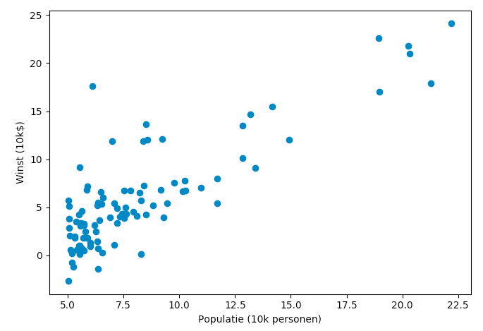
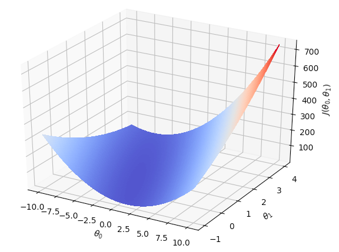

# Opgaven week 1

## Inleiding
Deze week werken we aan de lineaire regressie van data met één variabele. De data die we daarvoor gebruiken is de winst van een vervoerder gerelateerd aan de grootte van een stad waar die vervoerder werkzaam is. Je kunt je voorstellen dat het nuttig is om deze verhouding te weten, omdat je op basis hiervan geïnformeerd een besluit kunt nemen of je in een nieuwe stad (met een bepaalde grootte) een nieuw filiaal wilt openen.

De startcode van deze opgave kun je [hier downloaden](files/startcode_week1.zip). Het bestand `week1_data.pkl` bevat de data waar we mee gaan werken. Dit is een 97×2-numpy-vector: de eerste kolom bevat de grootte van de steden, de tweede kolom bevat de winst van de vervoerder.

Daarnaast vind je twee python-bestanden in de zip. Het bestand `exercise1.py` gebruikt de code in `uitwerkingen.py` om door de opgaven te lopen. Het is de bedoeling dat je het bestand `uitwerkingen.py` afmaakt. Bestudeer de code en het commentaar in beide bestanden om te zien hoe ze werken en wat de bedoeling ervan is.

## 1. het visualiseren van de data

Een eerste stap in elk machine-learning project is een beeld creëren van de data. Het eenvoudigst om dit te doen is door gebruik te maken van de library [`matplotlib`](https://matplotlib.org/). Hierin vind je een API [`pyplot`](https://matplotlib.org/stable/api/_as_gen/matplotlib.pyplot.html?highlight=pyplot#module-matplotlib.pyplot) waarmee je vrij eenvoudig een scatter plot kunt maken.

Bestudeer [de documentatie van `pyplot`](https://matplotlib.org/stable/api/_as_gen/matplotlib.pyplot.html?highlight=pyplot#module-matplotlib.pyplot) en implementeer aan de hand hiervan de functie `draw_graph` in `uitwerkingen.py`, zodat je een afbeelding zoals de onderstaande krijgt. Hoewel de data niet echt normaal verdeeld is, is er wel een zekere verhouding waar te nemen tussen de grootte van de stad en de winst die de vervoerder maakt. In de rest van deze opgave gaan we deze verhouding bepalen.



## 2. Het bepalen van de *cost function* (de kostenfunctie)

Zoals in de theorieles besproken is, is het bepalen van de verhouding tussen twee (of meer) grootheden een kwestie van het minimaliseren van de kostenfunctie: [de som van de gekwadrateerde fouten (SSE)](https://en.wikipedia.org/wiki/Residual_sum_of_squares). Dit minimaliseren doe je door middel van gradient descent en het is dikwijls nuttig om die kostenfunctie gedurende de iteraties bij te houden, zodat je de verschillende uitkomsten door je data heen kunt plotten – zo kun je bijvoorbeeld controleren of je niet in een lokaal minimum terecht bent gekomen. In deze opgave programmeren we de kostenfunctie verder uit; de volgende opgave gaat verder in op de gradient descent.

De kostenfunctie is gegeven door de volgende formule:

$$
 J(\theta) = \frac{1}{2m} \sum_{i=1}^{m} ( h_\theta(x^{(i)}) - y^{(i)} ) ^2
$$

Hierin is $J(\theta)$ de totale kost die berekend wordt met de huidige waarden van $\theta$. Verder is $h_{\theta}(x)$ de hypothese van de waarde (de voorspelling) en is $y$ de actuele (daadwerkelijke) waarde. Door het verschil tussen deze twee waarden voor elk datapunt op te tellen en uiteindelijk uit te middelen, komen we op de voorspellende waarde die de formule heeft met de huidige waarden van $\theta$.

De algemene formule voor de hypothese (de voorspelling) is als volgt: 

$$
h_\theta(x) = \theta^Tx = \theta_0 + \theta_1x 
$$

Omdat we op zoek zijn naar een lijn, hebben we feitelijk te maken met één parameter (een lijn is immers $y=ax + b = b + ax$). Allereerst bepalen we het aantal datapunten ($m$) en het aantal eigenschappen (*features*, $n$). Om de dimensionaliteit van de trainingsdata te laten corresponderen met $\theta$, voegen we vervolgens een rij van enen toe. Daarna isoleren we de laatste kolom van de data om de gewenste waarden te krijgen (de vector $y$); de rest van de data vormt dan de eigenlijke matrix $X$. Tenslotte initiëren we de vector $\theta$:

```python
m,n = data.shape
X = np.c_[np.ones(m), data[:, [0]]]
y = data[:, [1]]
theta = np.zeros( (2, 1) )
```

De voorspelde waarden in $X$, de actuele waarden in $y$ en een $theta$ worden aan de methode `compute_cost` meegegeven; deze functie moet de waarde van $J(\theta)$ teruggeven. Implementeer deze functie op basis van de beschrijving hierboven in het bestand `uitwerkingen.py` (zie ook de aanwijzingen in het bestand zelf); maak hem zo, dat hij werkt voor elke grootte van `theta`. Maak gebruik van een vectoriële implementatie.

Als je klaar bent, kun je het bestand `opgaven.py` runnen. Dit bestand roept `compute_cost aan en print de gevonden waarde uit. Als het goed is, krijg je uiteindelijk een waarde van rond de 32.07.

## 3a. Gradient descent
Als laatste maak je de methode `gradient_descent` in het bestand `uitwerkingen.py` af. In deze methode wordt een aantal stappen uitgevoerd, waarbij in elke stap de vector $\theta$ volgens de onderstaande formule wordt aangepast.

$$
\theta_j := \theta_j - \alpha \frac{1}{m}\sum_{i=1}^{m}(h_\theta(x^{(i)}) - y^{(i)})x^{(i)}_j
$$

Als het goed is, zorgt elke stap in deze methode ervoor dat $J(\theta)$ lager wordt. Let er wel op dat je alle $\theta_j$ tegelijkertijd aanpast (in dit geval is de grootte van $\theta$ 2, dus elke iteratie moeten er twee parameters worden aangepast). Let er verder op dat je *alleen*  $\theta$ aanpast: X en y zijn constante waarden die niet hoeven (of kunnen) te worden aangepast.

De algemene structuur in het bestand is al gegeven. Als je implementatie klaar is, kun je opnieuw het bestand `opgaven.py` aanroepen; deze roept de functie `gradient_descent` aan, zodat de update 1500 keer wordt gedaan. Als het goed is, is $\theta$ uiteindelijk rond de (-3.63, 1.16).

## 3b. kosten bijhouden

Omdat we, zoals gezegd, graag willen weten of de totale kost tijdens de *gradient descent* wel steeds minder wordt, is het van belang deze kosten tijdens deze *descent* bij te houden. Breid de functie `gradient_descent` aan zodat bij elke iteratie de functie `compute_cost` wordt aangeroepen met de huidige waarden van `theta`. Deze kosten stop je in de lijst `costs` (die al in de basiscode is geïnitialiseerd) en die retourneer je uiteindelijk eveneens (`gradient_descent` retourneert dus *twee* waarden).

Maak vervolgens de functie `draw_costs` in `uitwerkingen.py`. Deze functie moet de lijst meekrijgen die je hierboven in `gradient_descent` hebt gevuld. Maak gebruik van `pyplot` om deze lijst in een grafiekje te zetten. Als je dan het bestand `exercise.py` runt, krijg je als het goed is iets als het onderstaande plaatje:


## 4. Contour plot

In deze laatste opgave gebruik je de methode `compute_cost` die je hierboven hebt gemaakt om een <em>contour-plot</em> van de kosten te tekenen. Hierdoor kun je inzicht krijgen in hoe deze waarde zich ontwikkelt bij verschillende waarden van $\theta$. 

Het grootste deel van deze opgave is al in de methode `contour_plot()` in het bestand `uitwerkingen.py` gegeven; je hoeft alleen maar de waarden van de matrix `J_val` te vullen. Bestudeer het commentaar in het bestand voor meer toelichting. Als je klaar bent, roept het bestand `exercise1.py` de methode `contour_plot()` aan om de plot te tekenen. Als het goed is, ziet deze er ongeveer als hieronder uit.</p>

